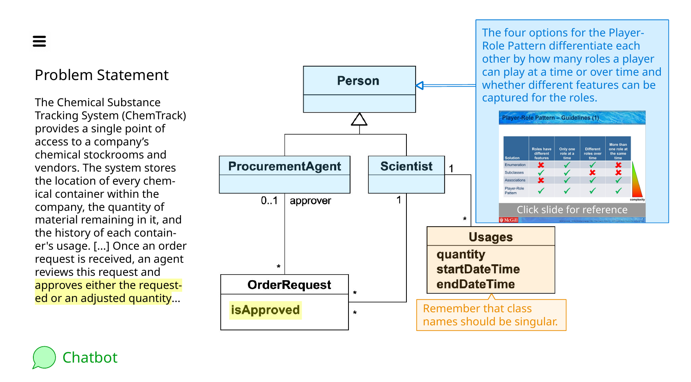
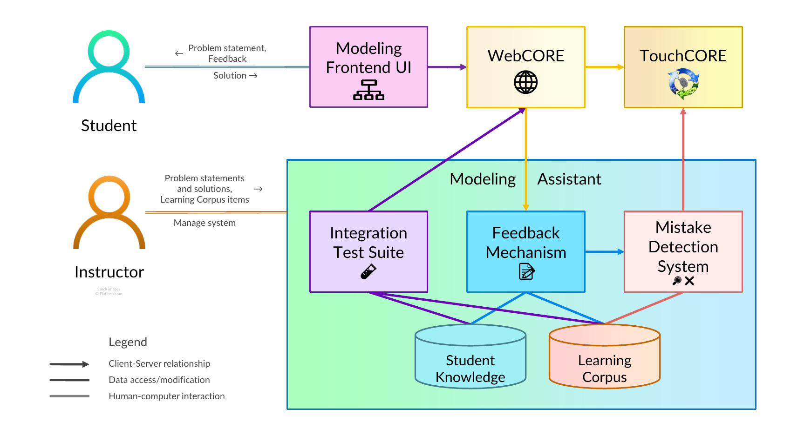
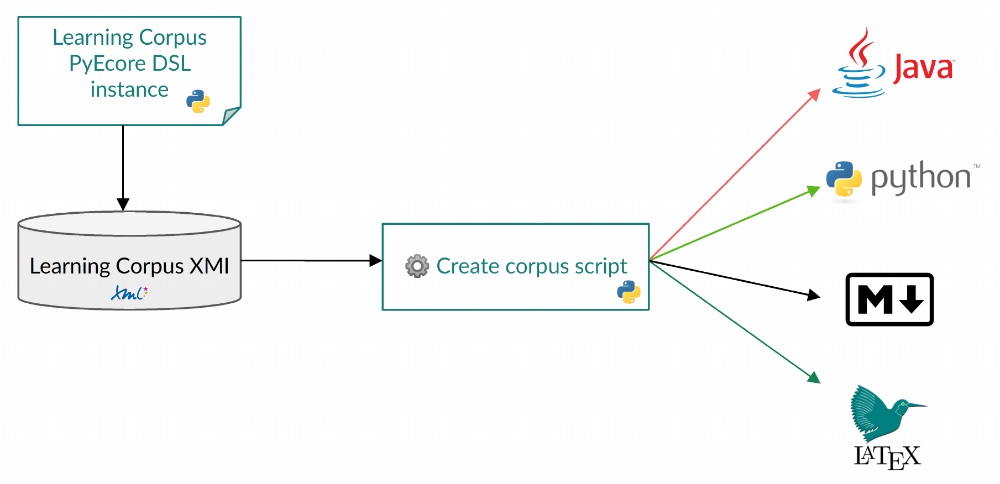

# Modeling Assistant

## Overview

This repository contains the source code and documentation for an
interactive domain modeling assistant developed at
[McGill University](https://www.mcgill.ca/).
This Modeling Assistant
teaches students the fundamentals of domain modeling
by asking them to model the concepts of a problem domain
and their relationships given a natural language problem statement,
and it can be extended to support other model types in the future,
eg, state machines, as described in
[one](https://doi.org/10.1145/3550356.3556502) of our papers.

This system compares a student solution to one provided by the
instructor, detects mistakes using the Mistake Detection System,
and returns feedback to the student with the Feedback Mechanism.

A UI mockup of the Modeling Assistant can be found below.

## System Architecture and Repository Structure

The Modeling Assistant application has the following structure.

The concepts of the application are defined using Ecore metamodels
(models of models) found in the
[`modelingassistant/model`](modelingassistant/model) folder.
For more information, see the [README](modelingassistant/model/README.md)
in that folder.

### Learning Corpus

The feedback shown to the student is obtained from a
[Learning Corpus](modelingassistant/corpus_descriptions/README.md)
which consists of a mistake type hierarchy with multiple feedback
levels for each mistake type, ranging from highlighting a UI element
to parametrized responses and responses with learning resources
such as quizzes.

The overall structure of the Learning Corpus is defined using its
[metamodel](modelingassistant/model/README.md).
Its contents are defined using an internal Python/PyEcore DSL in
[`corpusdefinition.py`](modelingassistant/pythonapp/corpusdefinition.py).
The [`createcorpus.py`](modelingassistant/pythonapp/createcorpus.py) script
uses this DSL to generate the
[default Learning Corpus instance](modelingassistant/learningcorpusinstances/default.learningcorpus)
as well as transformations to source code
([Python](modelingassistant/pythonapp/mistaketypes.py),
[Java](modelingassistant/src/learningcorpus/mistaketypes/MistakeTypes.java))
and human-readable output
([Markdown](modelingassistant/corpus_descriptions/README.md),
[LaTeX](modelingassistant/corpus_descriptions/learningcorpusdefs.tex)).

### Mistake Detection System

### Feedback Mechanism

_(details to follow)_

### Other Components

The **Modeling UI Frontend**
([Unity](https://github.com/eknuviad/domain-model-assistant),
JavaScript),
**[WebCORE](https://bitbucket.org/mcgillram/touchcore-web)**, and
**[TouchCORE](https://bitbucket.org/mcgillram/)**
are all developed in separate repositories.

## People

**Project Supervisor:** [Prof Gunter Mussbacher](http://www.ece.mcgill.ca/~gmussb1/)
([@gmussbacher](https://github.com/gmussbacher))

**Main Developers:**
[Younes Boubekeur](https://www.linkedin.com/in/younes-boubekeur/)
([@YounesB-McGill](https://github.com/YounesB-McGill)) and
[Prabhsimran Singh](https://prabhsimran-singh.github.io/)
([@Prabhsimran-Singh](https://github.com/Prabhsimran-Singh))

**Contributors:**
Fatma Alfalahi ([@fatmaalfalahi](https://github.com/fatmaalfalahi)),
Jasneet Kaur ([@Jasneet-Kaur-heer](https://github.com/Jasneet-Kaur-heer)),
Rijul Saini ([@Rijul5](https://github.com/Rijul5)),
Thomas Woodfine-MacPherson ([@r2d2117](https://github.com/r2d2117))

## Publications and Awards

### Theses

- Younes Boubekeur. 2022.
_A Learning Corpus and Feedback Mechanism for a Domain Modeling Assistant._
Master’s thesis. McGill University, Canada.
(approved and expected to be published in
[eScholarship@McGill](https://escholarship.mcgill.ca/) in November 2022)
- Prabhsimran Singh. 2022.
_Domain Modeling Mistake Detection System._
Master’s thesis. McGill University, Canada.
(approved and expected to be published in
[eScholarship@McGill](https://escholarship.mcgill.ca/) in November 2022)

### Papers

- Younes Boubekeur, Prabhsimran Singh, and Gunter Mussbacher. 2022.
_A DSL and Model Transformations to Specify Learning Corpora for Modeling Assistants._
In ACM/IEEE 25th International Conference on Model Driven Engineering
Languages and Systems (MODELS '22 Companion),
October 23–28, 2022, Montréal, QC, Canada. ACM, 8 pages.
https://doi.org/10.1145/3550356.3556502
- Prabhsimran Singh, Younes Boubekeur, and Gunter Mussbacher. 2022.
_Detecting Mistakes in a Domain Model._
In ACM/IEEE 25th International Conference on Model Driven Engineering
Languages and Systems (MODELS '22 Companion),
October 23–28, 2022, Montréal, QC, Canada. ACM, 10 pages.
https://doi.org/10.1145/3550356.3561583
- Younes Boubekeur and Gunter Mussbacher. 2020.
_Towards a Better Understanding of Interactions with a Domain Modeling Assistant._
In ACM/IEEE 23rd International Conference on Model Driven Engineering
Languages and Systems (MODELS '20 Companion),
October 18–23, 2020, Virtual Event, Canada. ACM, 10 pages.
https://doi.org/10.1145/3417990.3418742.
[Video presentation](https://vimeo.com/469525402)

### Awards

- :trophy: **Best 3 Minute Thesis (3MT) Presentation**:
Younes Boubekeur and Gunter Mussbacher.
_A Learning Corpus for a Domain Modeling Assistant to Teach Requirements Modeling._ 
Poster, Graduate Student Event, 27th International Working Conference on 
Requirements Engineering: Foundation for Software Quality (REFSQ '21),
Essen, Germany, April 2021.

## Related Projects

- **TouchCORE**:
[Website](https://www.cs.mcgill.ca/~joerg/SEL/TouchCORE.html),
[Sources and docs](https://bitbucket.org/mcgillram/)
- **Domain Modeling Assistant Unity Frontend**:
Available on [GitHub](https://github.com/eknuviad/domain-model-assistant)
