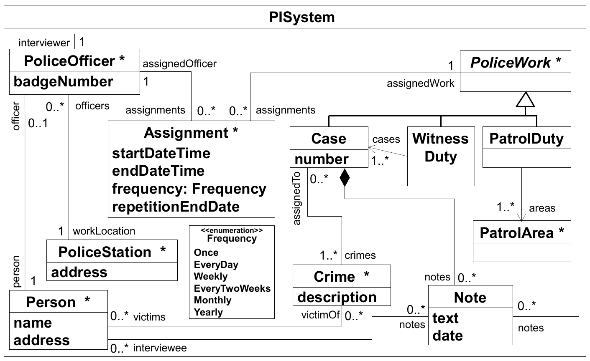
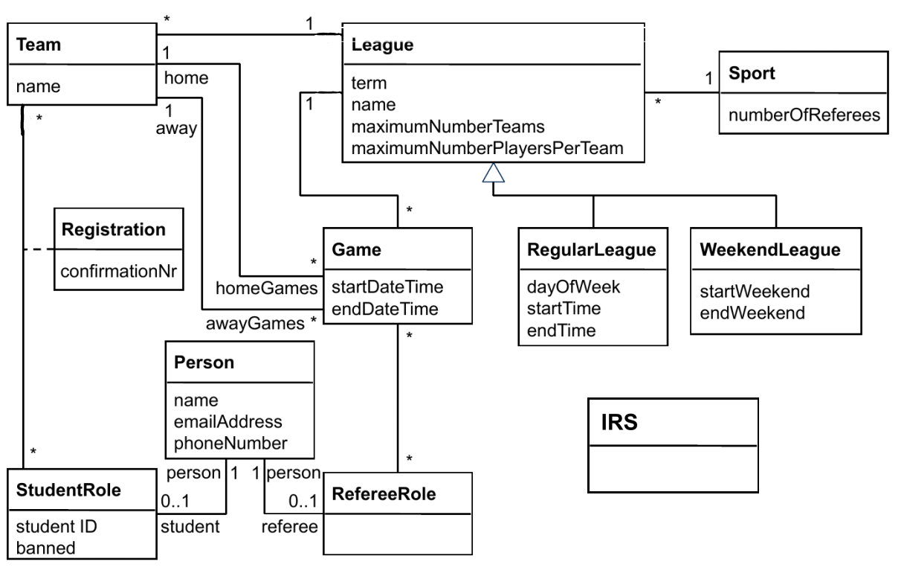
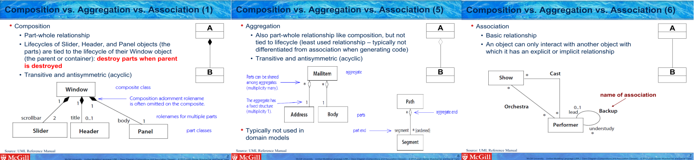
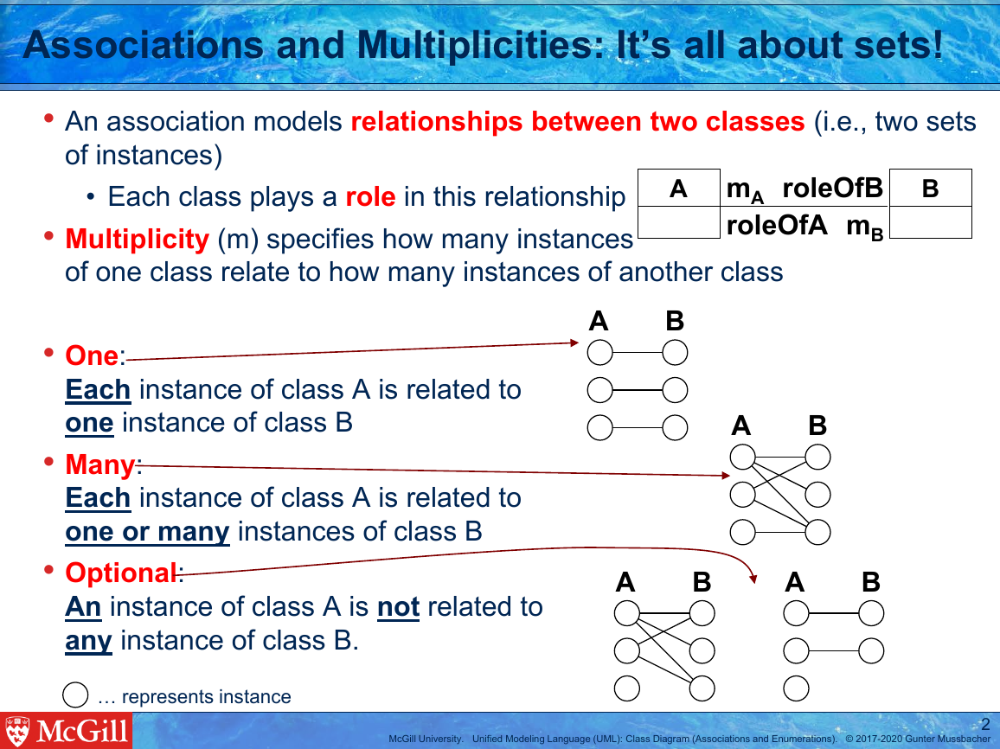
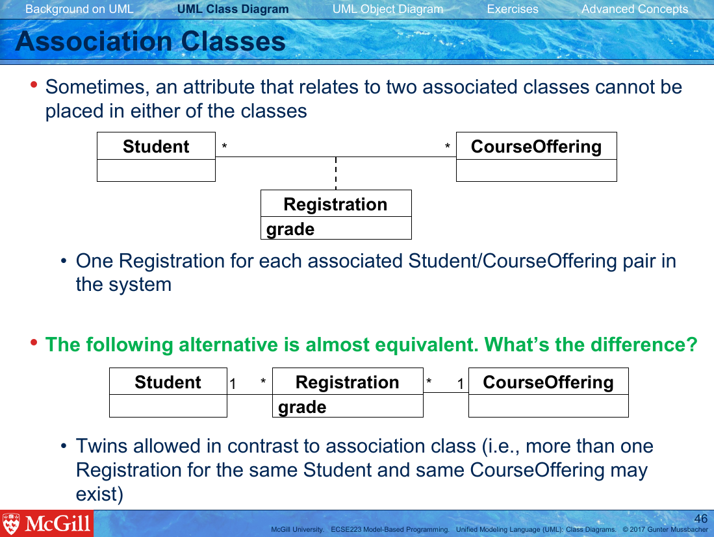

# Learning Corpus Content Outline

_**About this page:** This page is meant to be a human readable document
that describes some of the content of the learning corpus. This material
will be included in a more machine readable format later. The mistake 
types are taken from our paper [Towards a Better Understanding of Interactions with a Domain Modeling Assistant](https://doi.org/10.1145/3417990.3418742)._

## Table of Contents

1. [Wrong class](#wrong-class)
   1. [Missing class](#missing-class)
   1. [Extra (redundant) class](#extra-class)
   1. [Wrong class name (using plural, lowercase, or software engineering term)](#wrong-class-name)

1. [Wrong relationships](#wrong-relationships)
   1. [Using an attribute instead of an association](#using-an-attribute-instead-of-an-association)
   1. [Incomplete containment tree](#incomplete-containment-tree)
   1. [Using an association instead of an aggregation/composition or vice versa](#using-an-association-instead-of-an-aggregationcomposition-or-vice-versa)
   1. [Missing role names](#missing-role-names)
   1. [Wrong association class](#wrong-association-class)
   1. [Inapplicable generalization](#inapplicable-generalization)
   1. [Non-differentiated subclass](#non-differentiated-subclass)

1. [Modeling antipatterns or misuse of design patterns](#modeling-antipatterns-or-misuse-of-design-patterns)
   1. [Misuse of Player-Role Pattern](#misuse-of-player-role-Pattern)

_More to come..._

## Wrong class

### Missing class

Level 1: Highlight sentence of problem statement element

Level 2: Text response:

> Make sure you have modeled all the classes in the problem description.

Level 3: Highlight problem statement element

Level 4: Parameterized Response

> Remember to add the ${className} class.

### Extra class

Level 1: Highlight solution

Level 2: Text response:

> Make sure you only model the concepts mentioned in the problem description.

Level 3: Text response:

> You have an extra class. Can you find it?

Level 4: Parameterized Response

> The ${className} class is not part of the domain, so please remove it.

> Remember that a domain model should not contain concepts from the user interfaces or databases, like Window, Database, etc.

### Wrong class name

Level 1: Highlight solution

Level 2: Text response:

> Remember that class names must start with a Capital Letter.

> Remember that class names should be singular.

> Remember that a domain model should not contain software engineering terms.

Level 3: Parameterized Response

> ${className} should be ${pascalCase(className)}, with a Capital Letter.

> ${className} should be ${singular(className)}, using the singular.

> ${className} is a software engineering term, which does not belong in a domain model.

Level 4: Resource Response with Example:

> Please note these examples of correct vs incorrect class naming:
> :x: Examples to avoid | :heavy_check_mark: Good class names
> --- | ---
> pilot | Pilot
> Airplanes | Airplane 
> AirlineData | Airline

___

## Wrong relationships

### Using an attribute instead of an association

Level 1: Highlight attribute

Level 2: Text response

> Remember that attributes are simple pieces of data.

Level 3: Parameterized Response

> ${includingClass.attributeName} should be its own class.

Level 4: Resource Response with Quiz:

> Pick the classes which are modeled correctly.
>
> - [ ] class Person { address; }
> - [ ] class Person { * Person -- 1 Address; }; class Address {}
> - [ ] class Loan { libraryPatron; }

### Incomplete containment tree

Level 1: Highlight classes

Level 2: Text response

> What is the relationship between the highlighted classes?

Level 3: Parameterized Response

> ${containedClass} is a part of ${containerClass}, so how would you model this?

Level 4: Resource Response with Example

Observe the following domain model. Every single class is contained in the 
root class, `PISystem`, other than the root class itself.

Level 5: Resource Response with Quiz

Complete the containment tree for the following model.

_Possible approaches:_

* Use the envisioned UI for the quiz and let students create the
compostitions themselves.
* Multiple choice in the form: Pick the classes which are _directly_
contained in the `IRS` root node.
  `Team`, `League`, `Sport`, `Registration`, `Game`, `RegularLeague`,
  `WeekendLeague`, `Person`, `StudentRole`, `RefereeRole`, `IRS`.

### Using an association instead of an aggregation/composition or vice versa

Level 1: Highlight relationship

Level 2: Text response

> What is the relationship between these two concepts?

Level 3: Parameterized Response

> Why is ${incorrectlyContainedClass} contained in ${containerClass}?

> The relationship between ${containedClass} and ${containerClass} can be
modeled more precisely than with a simple association.

Level 4: Resource Response with Example

Please review the _Composition vs. Aggregation vs. Association_ section of 
the [UML Class Diagram lecture slides](https://mycourses2.mcgill.ca/) to 
better differentiate these relationships.

### Missing role names

Level 1: Highlight association

Level 2: Text response

> Can you model this relationship more precisely?

Level 3: Text response

> The multiplicities for this association are correct, but something else is missing!

Level 4: Resource Response with link to Reference

> Can you think of appropriate [role names](https://mycourses2.mcgill.ca/)
for this association? Role names help identify the role a class plays in a
relationship and can be important if there is more than one relationship
between the same two classes.

### Wrong association class

Level 1: Highlight association

Level 2: Text response

> Can you model this relationship more precisely?

> Is using an association class the best way to model this?

Level 3: Parameterized Response

> The association between ${firstClass} and ${secondClass} should (not) be
modeled with an [association class](https://mycourses2.mcgill.ca/).

Level 4: Parameterized Response

> Does it make sense to have multiple instances of the ${inBetweenClass}
linking ${firstClass} and ${secondClass}?

Level 5: Resource Response with link to Reference

### Inapplicable generalization

Level 1: Highlight classes

Level 2: Text response

> Can you find a better way to express this relationship?

> Is there a (direct) relationship between these two classes?

Level 3: Parameterized Response

> When creating a generalization between ${wrongSubclass} and
${wrongSuperclass}, make sure to follow the [checks for proper generalization](https://mycourses2.mcgill.ca/).

> ${wrongSubclass} is not a (direct) subclass of ${wrongSuperclass}.

Level 4: Resource Response with Quiz

<!-- TODO Complete following lists -->

> Place the following classes in an inheritance hierarchy:
>
> * `Vehicle`, `LandVehicle`, `AmphibiousVehicle`, `AirVehicle`, ...
> * `BusVehicle`, `LuxuryBus`, `TourBus`, `BusRoute` ...

Level 5: Resource Response with Reference and Quiz

Please review the [checks for proper generalization](https://mycourses2.mcgill.ca/) lecture material and complete the following:

The five checks for generalization are:
* Obeys the ________. (isA rule)
* Subclass must retain its ________. (distinctiveness)
* ...

### Non-differentiated subclass

Level 1: Highlight class

Level 2: Text response

> Is it really necessary to model this as a subclass?

Level 3: Parameterized Response

> ${wrongSubclass} does not differ from ${wrongSuperclass} in terms of
behavior or structure.

Level 4: Resource Response with Quiz

Which classes do not belong?
* `Account`, `SavingsAccount`, `OverdrawnAccount`, `CheckingAccount`, `MortgageAccount`, `ClosedAccount`, 

___

## Modeling antipatterns or misuse of design patterns

### Misuse of Player-Role Pattern

_More to come..._
