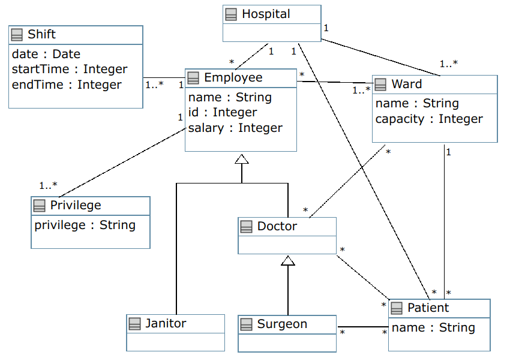
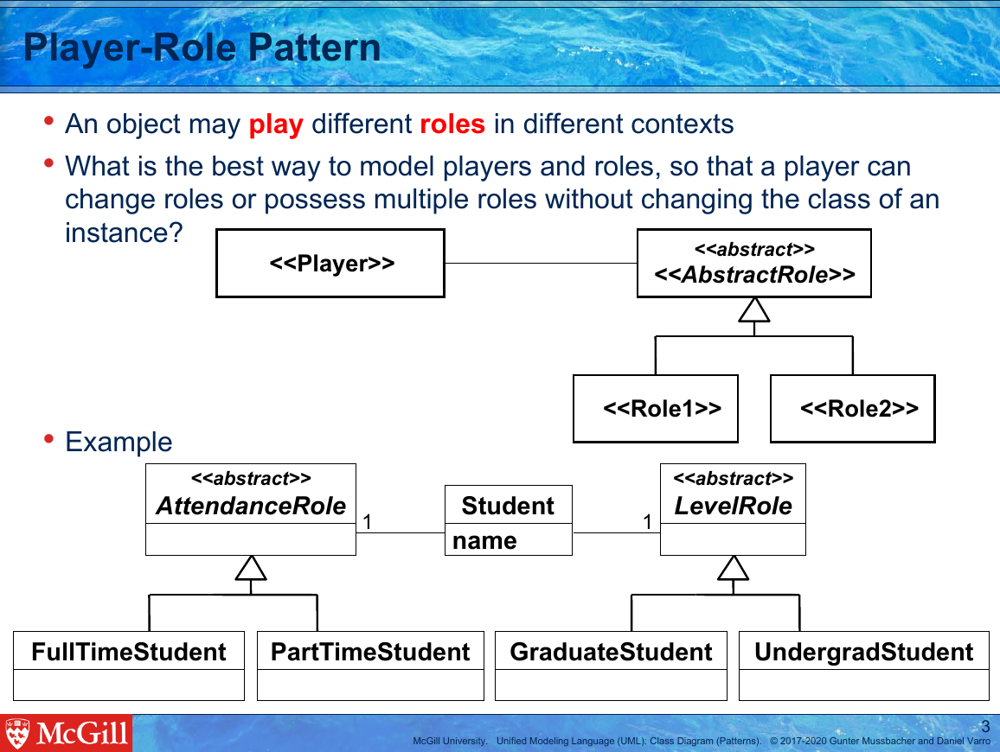
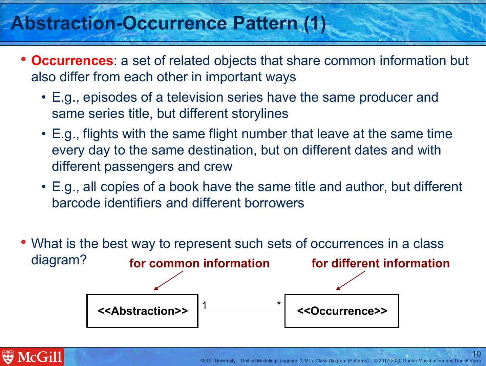

1. [Class mistakes](#class-mistakes)
   1. [Class name mistakes](#class-name-mistakes)
      1. [Plural class name](#plural-class-name)
      1. [Lowercase class name](#lowercase-class-name)
      1. [Software engineering term](#software-engineering-term)
      1. [Bad class name spelling](#bad-class-name-spelling)
      1. [Wrong class name but correct attributes/relationships](#wrong-class-name-but-correct-attributes-relationships)
      1. [Class should be abstract](#class-should-be-abstract)
      1. [Class should not be abstract](#class-should-not-be-abstract)
   1. [Enumeration mistakes](#enumeration-mistakes)
      1. [Regular class should be enumeration](#regular-class-should-be-enumeration)
      1. [Enumeration should be regular class](#enumeration-should-be-regular-class)
      1. [Missing enumeration](#missing-enumeration)
      1. [Extra enumeration](#extra-enumeration)
      1. [Bad enumeration name spelling](#bad-enumeration-name-spelling)
      1. [Missing enumeration item](#missing-enumeration-item)
      1. [Extra enumeration item](#extra-enumeration-item)
      1. [Bad enumeration item spelling](#bad-enumeration-item-spelling)
   1. [Missing class](#missing-class)
   1. [Extra class](#extra-class)

1. [Attribute mistakes](#attribute-mistakes)
   1. [Attribute name mistakes](#attribute-name-mistakes)
      1. [Bad attribute name spelling](#bad-attribute-name-spelling)
      1. [Uppercase attribute name](#uppercase-attribute-name)
   1. [Attribute in wrong class mistakes](#attribute-in-wrong-class-mistakes)
      1. [Attribute misplaced](#attribute-misplaced)
      1. [Attribute duplicated](#attribute-duplicated)
      1. [Attribute misplaced in generalization hierarchy](#attribute-misplaced-in-generalization-hierarchy)
   1. [Extra attribute mistakes](#extra-attribute-mistakes)
      1. [Plural attribute](#plural-attribute)
      1. [List attribute](#list-attribute)
      1. [Extra attribute](#extra-attribute)
   1. [Attribute property mistakes](#attribute-property-mistakes)
      1. [Wrong attribute type](#wrong-attribute-type)
      1. [Missing attribute type](#missing-attribute-type)
      1. [Attribute should be static](#attribute-should-be-static)
      1. [Attribute should not be static](#attribute-should-not-be-static)
   1. [Missing attribute](#missing-attribute)

1. [Relationship mistakes](#relationship-mistakes)
   1. [Missing association/aggregation mistakes](#missing-association-aggregation-mistakes)
      1. [Missing association](#missing-association)
      1. [Missing aggregation](#missing-aggregation)
      1. [Missing n-ary association](#missing-n-ary-association)
      1. [Using attribute instead of association](#using-attribute-instead-of-association)
   1. [Extra association mistakes](#extra-association-mistakes)
      1. [Extra association](#extra-association)
      1. [Extra aggregation](#extra-aggregation)
      1. [Extra n-ary association](#extra-n-ary-association)
   1. [Multiplicity mistakes](#multiplicity-mistakes)
      1. [Infinite recursive dependency](#infinite-recursive-dependency)
      1. [Wrong multiplicity](#wrong-multiplicity)
      1. [Missing multiplicity](#missing-multiplicity)
   1. [Role name mistakes](#role-name-mistakes)
      1. [Missing role name](#missing-role-name)
      1. [Role should be static](#role-should-be-static)
      1. [Role should not be static](#role-should-not-be-static)
      1. [Bad role name spelling](#bad-role-name-spelling)
      1. [Representing an action with an association](#representing-an-action-with-an-association)
      1. [Wrong role name but correct association](#wrong-role-name-but-correct-association)
   1. [Association type mistakes](#association-type-mistakes)
      1. [Using aggregation instead of association](#using-aggregation-instead-of-association)
      1. [Using composition instead of association](#using-composition-instead-of-association)
      1. [Using directed relationship instead of undirected relationship](#using-directed-relationship-instead-of-undirected-relationship)
      1. [Using undirected relationship instead of directed relationship](#using-undirected-relationship-instead-of-directed-relationship)
      1. [Reversed relationship direction](#reversed-relationship-direction)
      1. [Using composition instead of aggregation](#using-composition-instead-of-aggregation)
      1. [Using binary association instead of n-ary association](#using-binary-association-instead-of-n-ary-association)
      1. [Using n-ary association instead of binary association](#using-n-ary-association-instead-of-binary-association)
      1. [Using intermediate class instead of n-ary association](#using-intermediate-class-instead-of-n-ary-association)
      1. [Using n-ary association instead of intermediate class](#using-n-ary-association-instead-of-intermediate-class)
   1. [Association name mistakes](#association-name-mistakes)
      1. [Missing association name](#missing-association-name)
      1. [Bad association name spelling](#bad-association-name-spelling)
   1. [Association class mistakes](#association-class-mistakes)
      1. [Missing association class](#missing-association-class)
      1. [Extra association class](#extra-association-class)
      1. [Bad association class name spelling](#bad-association-class-name-spelling)
      1. [Association class should be regular class](#association-class-should-be-regular-class)
      1. [Regular class should be association class](#regular-class-should-be-association-class)
   1. [Composition mistakes](#composition-mistakes)
      1. [Missing composition](#missing-composition)
      1. [Extra composition](#extra-composition)
      1. [Using association instead of aggregation](#using-association-instead-of-aggregation)
      1. [Using association instead of composition](#using-association-instead-of-composition)
      1. [Using aggregation instead of composition](#using-aggregation-instead-of-composition)
      1. [Composed part contained in more than one parent](#composed-part-contained-in-more-than-one-parent)
      1. [Incomplete containment tree](#incomplete-containment-tree)
   1. [Generalization mistakes](#generalization-mistakes)
      1. [Missing generalization](#missing-generalization)
      1. [Extra generalization](#extra-generalization)
      1. [Generalization does not follow isA rule](#generalization-does-not-follow-isa-rule)
      1. [Subclass not distinct across lifetime](#subclass-not-distinct-across-lifetime)
      1. [Inherited feature does not make sense for subclass](#inherited-feature-does-not-make-sense-for-subclass)
      1. [Subclass is an instance of superclass](#subclass-is-an-instance-of-superclass)
      1. [Non-differentiated subclass](#non-differentiated-subclass)
      1. [Reversed generalization direction](#reversed-generalization-direction)
      1. [Wrong superclass](#wrong-superclass)

1. [Design pattern mistakes](#design-pattern-mistakes)
   1. [Player-Role Pattern mistakes](#player-role-pattern-mistakes)
      1. [Missing Player-Role pattern](#missing-player-role-pattern)
      1. [Incomplete Player-Role pattern](#incomplete-player-role-pattern)
      1. [Subclass should be full Player-Role pattern](#subclass-should-be-full-player-role-pattern)
      1. [Subclass should be association Player-Role pattern](#subclass-should-be-association-player-role-pattern)
      1. [Subclass should be enumeration Player-Role pattern](#subclass-should-be-enumeration-player-role-pattern)
      1. [Association should be full Player-Role pattern](#association-should-be-full-player-role-pattern)
      1. [Association should be subclass Player-Role pattern](#association-should-be-subclass-player-role-pattern)
      1. [Association should be enumeration Player-Role pattern](#association-should-be-enumeration-player-role-pattern)
      1. [Enumeration should be full Player-Role pattern](#enumeration-should-be-full-player-role-pattern)
      1. [Enumeration should be subclass Player-Role pattern](#enumeration-should-be-subclass-player-role-pattern)
      1. [Enumeration should be association Player-Role pattern](#enumeration-should-be-association-player-role-pattern)
      1. [Full Player-Role pattern should be subclass](#full-player-role-pattern-should-be-subclass)
      1. [Full Player-Role pattern should be association](#full-player-role-pattern-should-be-association)
      1. [Full Player-Role pattern should be enumeration](#full-player-role-pattern-should-be-enumeration)
   1. [Abstraction-Occurrence pattern mistakes](#abstraction-occurrence-pattern-mistakes)
      1. [Missing Abstraction-Occurrence pattern](#missing-abstraction-occurrence-pattern)
      1. [Incomplete Abstraction-Occurrence pattern](#incomplete-abstraction-occurrence-pattern)
      1. [Missing association in Abstraction-Occurrence pattern](#missing-association-in-abstraction-occurrence-pattern)
      1. [Generalization should be association in Abstraction-Occurrence pattern](#generalization-should-be-association-in-abstraction-occurrence-pattern)

## Class mistakes

### Class name mistakes

#### Plural class name

Student element: Class. Instructor element: Class.

Level 1: Highlight solution

Level 2: Text response:

> Remember that class names should be singular.

Level 3: Parametrized response:

> ${stud_cls} should be ${inst_cls}, using the singular.

Level 4: Resource response with Example:

> Please note these examples of correct vs incorrect class naming:
> :x: Examples to avoid | :heavy_check_mark: Good class names
> --- | ---
> pilot | Pilot
> Airplanes | Airplane 
> AirlineData | Airline

Level 5: Resource response with Reference:

> Please review the [Classes](https://mycourses2.mcgill.ca/) part of the Class Diagram lecture.

#### Lowercase class name

Student element: Class. Instructor element: Class.

Level 1: Highlight solution

Level 2: Text response:

> Remember that class names must start with a capital letter.

Level 3: Parametrized response:

> ${stud_cls} should be ${inst_cls}, with a capital letter.

Level 4: Resource response with Example:

> Please note these examples of correct vs incorrect class naming:
> :x: Examples to avoid | :heavy_check_mark: Good class names
> --- | ---
> pilot | Pilot
> Airplanes | Airplane 
> AirlineData | Airline

Level 5: Resource response with Reference:

> Please review the [Classes](https://mycourses2.mcgill.ca/) part of the Class Diagram lecture.

#### Software engineering term

Student element: Class. Instructor element: Class.

Level 1: Highlight solution

Level 2: Text response:

> Remember that a domain model should not contain software engineering terms.

Level 3: Parametrized response:

> ${stud_cls} contains a software engineering term (e.g., data, database, table), which does not belong in a domain model.

Level 4: Resource response with Example:

> Please note these examples of correct vs incorrect class naming:
> :x: Examples to avoid | :heavy_check_mark: Good class names
> --- | ---
> pilot | Pilot
> Airplanes | Airplane 
> AirlineData | Airline

Level 5: Resource response with Reference:

> Please review the [Classes](https://mycourses2.mcgill.ca/) part of the Class Diagram lecture.

#### Bad class name spelling

Student element: Class. Instructor element: Class.

Level 1: Highlight solution

Level 2: Text response:

> Double check this class name.

Level 3: Parametrized response:

> The ${stud_cls} class has a misspelled name.

Level 4: Parametrized response:

> The ${stud_cls} class should be changed to ${inst_cls}.

Level 5: Resource response with Reference:

> Please review the [Classes](https://mycourses2.mcgill.ca/) part of the Class Diagram lecture.

#### Wrong class name but correct attributes/relationships

Student element: Class. Instructor element: Class.

Level 1: Highlight solution

Level 2: Text response:

> Double check this class name.

Level 3: Parametrized response:

> The ${stud_cls} class has a name that is not quite right but the attributes and/or associations are correct.

Level 4: Parametrized response:

> The ${stud_cls} class should be changed to ${inst_cls}.

Level 5: Resource response with Reference:

> Please review the [Classes](https://mycourses2.mcgill.ca/) part of the Class Diagram lecture.

#### Class should be abstract

Student element: Class. Instructor element: Class.

Level 1: Highlight solution

Level 2: Text response:

> Isn't there something special about this class?

Level 3: Parametrized response:

> ${stud_cls} should be abstract.

Level 4: Resource response with Reference:

> Please review the [Classes](https://mycourses2.mcgill.ca/) part of the Class Diagram lecture.

#### Class should not be abstract

Student element: Class. Instructor element: Class.

Level 1: Highlight solution

Level 2: Text response:

> Is there something special about this class?

Level 3: Parametrized response:

> ${stud_cls} should not be abstract.

Level 4: Resource response with Reference:

> Please review the [Classes](https://mycourses2.mcgill.ca/) part of the Class Diagram lecture.

### Enumeration mistakes

#### Regular class should be enumeration

Student element: Class. Instructor element: Enumeration.

Level 1: Highlight solution

Level 2: Text response:

> Is there anything special about this class?

Level 3: Parametrized response:

> The ${stud_cls} can only be one of ${inst_enum.literals.length} options, so what is the best way to model this?

Level 4: Resource response with Reference:

> Please review the [Enumeration](https://mycourses2.mcgill.ca/) part of the Class Diagram lecture.

#### Enumeration should be regular class

Student element: Enumeration. Instructor element: Class.

Level 1: Highlight solution

Level 2: Text response:

> Is there anything special about this class?

Level 3: Parametrized response:

> Is ${stud_enum} limited to a fixed set of options? Can this be modeled differently?

Level 4: Resource response with Reference:

> Please review the [Enumeration](https://mycourses2.mcgill.ca/) part of the Class Diagram lecture.

#### Missing enumeration

Instructor element: Enumeration.

Level 1: Highlight sentence(s) in problem statement referring to the instructor element

Level 2: Text response:

> How would you model this concept?

Level 3: Text response:

> Model this concept with an enumeration.

Level 4: Parametrized response:

> Add a ${inst_enum} enumeration.

Level 5: Resource response with Reference:

> Please review the [Enumeration](https://mycourses2.mcgill.ca/) part of the Class Diagram lecture.

#### Extra enumeration

Student element: Enumeration. 

Level 1: Highlight solution

Level 2: Text response:

> Is this enumeration really necessary?

Level 3: Parametrized response:

> Remove the ${stud_enum} enumeration. It is not needed.

Level 4: Resource response with Reference:

> Please review the [Enumeration](https://mycourses2.mcgill.ca/) part of the Class Diagram lecture.

#### Bad enumeration name spelling

Student element: Enumeration. Instructor element: Enumeration.

Level 1: Highlight solution

Level 2: Text response:

> Double check the name of this enumeration.

Level 3: Parametrized response:

> The ${stud_enum} should be changed to ${inst_enum}.

Level 4: Resource response with Reference:

> Please review the [Enumeration](https://mycourses2.mcgill.ca/) part of the Class Diagram lecture.

#### Missing enumeration item

Student element: Enumeration. Instructor element: Enumeration item.

Level 1: Highlight solution

Level 2: Text response:

> Is there anything missing here?

Level 3: Parametrized response:

> The ${stud_enum} enumeration is missing an item.

Level 4: Parametrized response:

> Add ${inst_enumitem} to the ${stud_enum} enumeration.

Level 5: Resource response with Reference:

> Please review the [Enumeration](https://mycourses2.mcgill.ca/) part of the Class Diagram lecture.

#### Extra enumeration item

Student element: Enumeration item. 

Level 1: Highlight solution

Level 2: Text response:

> Should this really be here?

Level 3: Parametrized response:

> ${stud_enumitem} does not belong in the ${stud_enumitem.enum} enumeration.

Level 4: Resource response with Reference:

> Please review the [Enumeration](https://mycourses2.mcgill.ca/) part of the Class Diagram lecture.

#### Bad enumeration item spelling

Student element: Enumeration item. Instructor element: Enumeration item.

Level 1: Highlight solution

Level 2: Text response:

> Double check this enumeration item.

Level 3: Parametrized response:

> ${stud_enumitem} in the ${stud_enumitem.enum} should be changed to ${inst_enumitem}.

Level 4: Resource response with Reference:

> Please review the [Enumeration](https://mycourses2.mcgill.ca/) part of the Class Diagram lecture.

### Missing class

Instructor element: Class.

Level 1: Highlight sentence(s) in problem statement referring to the instructor element

Level 2: Text response:

> Make sure you have modeled all the classes in the problem description.

Level 3: Highlight specific problem statement elements referring to the instructor element

Level 4: Parametrized response:

> Remember to add the ${inst_cls} class.

Level 5: Resource response with Reference:

> Please review the [Classes](https://mycourses2.mcgill.ca/) part of the Class Diagram lecture.

### Extra class

Student element: Class. 

Level 1: Highlight solution

Level 2: Text response:

> Make sure you only model the concepts mentioned in the problem description.

Level 3: Text response:

> Is it really necessary to include this class?

Level 4: Parametrized response:

> The ${stud_cls} class is not part of the problem domain, so please remove it.

Level 5: Resource response with Reference:

> Please review the [Classes](https://mycourses2.mcgill.ca/) part of the Class Diagram lecture.

## Attribute mistakes

### Attribute name mistakes

#### Bad attribute name spelling

Student element: Attribute. Instructor element: Attribute.

Level 1: Highlight solution

Level 2: Text response:

> Double check this attribute name.

Level 3: Parametrized response:

> The ${stud_attr.cls}.${stud_attr} attribute is misspelled.[ Use the same spelling as the problem description.]

Level 4: Resource response with List multiple-choice quiz:

Select all the correct attribute names from the list below.

- [ ] needsReciept
- [x] numberOfItems
- [ ] ID
- [ ] numItems
- [ ] Name
- [x] identifier

Level 5: Resource response with Reference:

> Please review the [Attribute](https://mycourses2.mcgill.ca/) and [Noun Analysis](https://mycourses2.mcgill.ca/) parts of the Class Diagram lecture.

#### Uppercase attribute name

Student element: Attribute. Instructor element: Attribute.

Level 1: Highlight solution

Level 2: Text response:

> Remember that attributes are written in `lowerCamelCase`.

Level 3: Parametrized response:

> The ${stud_attr.cls}.${stud_attr} attribute incorrectly starts with an uppercase letter. Attributes should start with a lowercase letter.

Level 4: Resource response with List multiple-choice quiz:

Select all the correct attribute names from the list below.

- [ ] needsReciept
- [x] numberOfItems
- [ ] ID
- [ ] numItems
- [ ] Name
- [x] identifier

Level 5: Resource response with Reference:

> Please review the [Attribute](https://mycourses2.mcgill.ca/) and [Noun Analysis](https://mycourses2.mcgill.ca/) parts of the Class Diagram lecture.

### Attribute in wrong class mistakes

#### Attribute misplaced

Student element: Attribute. Instructor element: Attribute.

Level 1: Highlight solution

Level 2: Text response:

> Can you think of a better place for this attribute?

Level 3: Parametrized response:

> The ${stud_attr} attribute does not belong in the ${stud_attr.cls} class. Where else can we place it?

Level 4: Parametrized response:

> The ${stud_attr} attribute belongs in the ${inst_attr.cls} class.

Level 5: Resource response with Reference:

> Please review the [Attribute](https://mycourses2.mcgill.ca/) and [Noun Analysis](https://mycourses2.mcgill.ca/) parts of the Class Diagram lecture.

#### Attribute duplicated

Student element: Attribute. 

Level 1: Highlight solution

Level 3: Text response:

> Does this need to be included more than once?

Level 4: Parametrized response:

> The ${stud_attr} already exists in the same class or another class in the generalization hierarchy, so there is no need to include it again.

Level 5: Resource response with Reference:

> Please review the [Attribute](https://mycourses2.mcgill.ca/) and [Noun Analysis](https://mycourses2.mcgill.ca/) parts of the Class Diagram lecture.

#### Attribute misplaced in generalization hierarchy

Student element: Attribute. Instructor element: Attribute.

Level 1: Highlight solution

Level 2: Text response:

> Can you think of a better place for this?

Level 3: Parametrized response:

> The ${stud_attr} attribute belongs in the ${inst_attr.cls} class, i.e., a different class in the inheritance hierarchy.

Level 4: Resource response with Reference:

> Please review the [Attribute](https://mycourses2.mcgill.ca/) and [Noun Analysis](https://mycourses2.mcgill.ca/) parts of the Class Diagram lecture.

### Extra attribute mistakes

#### Plural attribute

Student element: Attribute. Instructor element: Attribute.

Level 1: Highlight solution

Level 2: Text response:

> Double check this attribute name.

Level 3: Parametrized response:

> The ${stud_attr.cls}.${stud_attr} attribute should be singular.

Level 4: Resource response with List multiple-choice quiz:

Pick the classes which are modeled correctly with Umple.

- [ ] class Student { courses; }
- [ ] class Folder { List<File> files; }
- [x] class Restaurant { 1 -- * Employee; }

Level 5: Resource response with Reference:

> Please review the [Attribute](https://mycourses2.mcgill.ca/) and [Noun Analysis](https://mycourses2.mcgill.ca/) parts of the Class Diagram lecture.

#### List attribute

Student element: Attribute. Instructor element: Attribute.

Level 1: Highlight solution

Level 2: Text response:

> Is there a better way to model this concept?

Level 3: Text response:

> Remember that attributes are simple pieces of data.

Level 4: Parametrized response:

> ${stud_attr} should be modeled as an association instead.

Level 5: Resource response with List multiple-choice quiz:

Pick the classes which are modeled correctly with Umple.

- [ ] class Student { courses; }
- [ ] class Folder { List<File> files; }
- [x] class Restaurant { 1 -- * Employee; }

Level 6: Resource response with Reference:

> Please review the [Attribute](https://mycourses2.mcgill.ca/) and [Noun Analysis](https://mycourses2.mcgill.ca/) parts of the Class Diagram lecture.

#### Extra attribute

Student element: Attribute. 

Level 1: Highlight solution

Level 2: Text response:

> Do we really need to model this concept?

Level 3: Parametrized response:

> The ${stud_attr} in the ${stud_attr.cls} class is not needed.

Level 4: Resource response with Reference:

> Please review the [Attribute](https://mycourses2.mcgill.ca/) and [Noun Analysis](https://mycourses2.mcgill.ca/) parts of the Class Diagram lecture.

### Attribute property mistakes

#### Wrong attribute type

Student element: Attribute. Instructor element: Attribute.

Level 1: Highlight solution

Level 2: Text response:

> Double check the properties of this attribute.

Level 3: Parametrized response:

> Can you think of a better type for ${stud_attr}?

Level 4: Parametrized response:

> The ${stud_attr.cls}.${stud_attr} attribute should be of type ${inst_attr.type}.

Level 5: Resource response with Reference:

> Please review the [Attribute](https://mycourses2.mcgill.ca/) and [Noun Analysis](https://mycourses2.mcgill.ca/) parts of the Class Diagram lecture.

#### Missing attribute type

Student element: Attribute. Instructor element: Attribute.

Level 1: Highlight solution

Level 2: Parametrized response:

> The ${stud_attr.cls}.${stud_attr} attribute is missing something.

Level 3: Parametrized response:

> The type of the ${stud_attr.cls}.${stud_attr} attribute should be ${inst_attr.type}.

Level 4: Resource response with Reference:

> Please review the [Attribute](https://mycourses2.mcgill.ca/) and [Noun Analysis](https://mycourses2.mcgill.ca/) parts of the Class Diagram lecture.

#### Attribute should be static

Student element: Attribute. Instructor element: Attribute.

Level 1: Highlight solution

Level 2: Text response:

> Isn't there something special about this attribute?

Level 3: Parametrized response:

> ${stud_attr} should be static, because its value is the same for all instances of ${stud_attr.cls}.

Level 4: Resource response with Reference:

> Please review the [Attribute](https://mycourses2.mcgill.ca/) and [Noun Analysis](https://mycourses2.mcgill.ca/) parts of the Class Diagram lecture.

#### Attribute should not be static

Student element: Attribute. Instructor element: Attribute.

Level 1: Highlight solution

Level 2: Text response:

> Double check the properties of this attribute.

Level 3: Parametrized response:

> ${stud_attr} should not be static, because its value may be different for instances of ${stud_attr.cls}.

Level 4: Resource response with Reference:

> Please review the [Attribute](https://mycourses2.mcgill.ca/) and [Noun Analysis](https://mycourses2.mcgill.ca/) parts of the Class Diagram lecture.

### Missing attribute

Student element: Class. Instructor element: Attribute.

Level 1: Highlight solution

Level 2: Text response:

> Make sure to model all the attributes of this class.

Level 3: Parametrized response:

> A ${inst_attr.cls} has a ${inst_attr}.

Level 4: Resource response with Reference:

> Please review the [Attribute](https://mycourses2.mcgill.ca/) and [Noun Analysis](https://mycourses2.mcgill.ca/) parts of the Class Diagram lecture.

## Relationship mistakes

### Missing association/aggregation mistakes

#### Missing association

Instructor element: Association.

Level 1: Highlight sentence(s) in problem statement referring to the instructor element

Level 2: Text response:

> How should this relationship be modeled?

Level 3: Parametrized response:

> How would you capture the relationship between ${inst_assoc.end0.cls} and ${inst_assoc.end1.cls}?

Level 4: Resource response with Reference:

> Please review the _Composition vs. Aggregation vs. Association_ section of 
the [UML Class Diagram lecture slides](https://mycourses2.mcgill.ca/) to 
better understand these relationships and where they are used.

#### Missing aggregation

Instructor elements: Aggregation, Whole association end, Part association end.

Level 1: Highlight sentence(s) in problem statement referring to the instructor element(s)

Level 2: Text response:

> How should this relationship be modeled?

Level 3: Parametrized response:

> How would you capture that a ${inst_whole_assocend.refcls} has a ${inst_part_assocend.refcls}?

Level 4: Parametrized response:

> Use aggregation to model the relationship between ${inst_part_assocend.cls} and ${inst_whole_assocend.cls}.

Level 5: Resource response with Reference:

> Please review the _Composition vs. Aggregation vs. Association_ section of 
the [UML Class Diagram lecture slides](https://mycourses2.mcgill.ca/) to 
better understand these relationships and where they are used.

#### Missing n-ary association

Instructor elements: Association, Association ends.

Level 1: Highlight sentence(s) in problem statement referring to the instructor element(s)

Level 2: Text response:

> How should this relationship be modeled?

Level 3: Parametrized response:

> How would you capture the relationship between ${inst_assoc.cls*}?

Level 4: Resource response with Reference:

> Please review the _Composition vs. Aggregation vs. Association_ section of 
the [UML Class Diagram lecture slides](https://mycourses2.mcgill.ca/) to 
better understand these relationships and where they are used.

#### Using attribute instead of association

Student element: Attribute. Instructor element: Association end.

Level 1: Highlight solution

Level 2: Text response:

> Remember that attributes are simple pieces of data.

Level 3: Parametrized response:

> ${stud_attr} should be its own class.

Level 4: Resource response with List multiple-choice quiz:

Pick the class(es) modeled correctly in Umple.

- [ ] class BankAccount { Client client; }
- [x] class BankAccount { * -- 1..2 Client clients; }; class Client {}
- [ ] class BankAccount { 1..2 -- * Client clients; }; class Client {}
- [ ] class Loan { libraryPatron; }

Level 5: Resource response with Reference:

> Please review the _Composition vs. Aggregation vs. Association_ section of 
the [UML Class Diagram lecture slides](https://mycourses2.mcgill.ca/) to 
better understand these relationships and where they are used.

### Extra association mistakes

#### Extra association

Student element: Association. 

Level 1: Highlight solution

Level 2: Text response:

> Is this association really necessary?

Level 3: Parametrized response:

> There should not be an association between ${stud_assoc.end0.cls} and ${stud_assoc.end1.cls}.

Level 4: Resource response with List multiple-choice quiz:

Find the redundant association(s) in this class diagram:

- [x] Hospital -- Patient
- [ ] Hospital -- Employee
- [x] Patient -- Surgeon
- [x] Doctor -- Ward
- [ ] Hospital -- Ward

Level 5: Resource response with Reference:

> Please review the [domain modeling lecture](https://mycourses2.mcgill.ca/) to know which concepts should be a part of a domain model.

#### Extra aggregation

Student elements: Aggregation, Whole association end, Part association end. 

Level 1: Highlight solution

Level 2: Text response:

> Is this aggregation really necessary?

Level 3: Parametrized response:

> There should not be an aggregation between ${stud_aggr.end0.cls} and ${stud_aggr.end1.cls}.

Level 4: Resource response with Reference:

> Please review the [domain modeling lecture](https://mycourses2.mcgill.ca/) to know which concepts should be a part of a domain model.

#### Extra n-ary association

Student elements: Association, Association ends. 

Level 1: Highlight solution

Level 2: Text response:

> Is this association really necessary?

Level 3: Parametrized response:

> The relationship between the ${stud_assoc.cls*} classes is redundant.

Level 4: Resource response with Reference:

> Please review the [domain modeling lecture](https://mycourses2.mcgill.ca/) to know which concepts should be a part of a domain model.

### Multiplicity mistakes

#### Infinite recursive dependency

Student element: Association ends. 

Level 1: Highlight solution

Level 2: Text response:

> Double check this relationship.

Level 3: Text response:

> The multiplicit(y|ies) for this relationship (is|are) incorrect.

Level 4: Parametrized response:

> Is it a good idea to specify that every ${stud_assocend0.cls} has a minimum of ${stud_assocend0.lowerBound} ${stud_assocend0}?

Level 5: Resource response with List multiple-choice quiz:

Given the following class diagram modeled in Umple, select the correct answer(s).

class Employee { 1 supervisor -- * Employee employees; }

- [ ] The class diagram is correct.
- [ ] The class diagram is incorrect, because some Employees do not oversee any other Employees.
- [ ] The "employees" multiplicity should be 1..* instead of *.
- [x] The class diagram is incorrect, because at least one Employee cannot have a supervisor, otherwise an infinite recursive dependency will occur.

Level 6: Resource response with Reference:

> Please review the [multiplicities](https://mycourses2.mcgill.ca/) part of the Class Diagram lecture.

#### Wrong multiplicity

Student element: Association end. Instructor element: Association end.

Level 1: Highlight solution

Level 2: Text response:

> Double check this association.

Level 3: Text response:

> The multiplicity for this association end is incorrect.

Level 4: Parametrized response:

> How many ${stud_assocend.opposite.cls} instances does a ${stud_assocend.cls} have?

Level 5: Resource response with List multiple-choice quiz:

Pick the association(s) with correct multiplicities:

- [ ] 1 EmployeeRole -- 1 Person;
- [x] * Episode -- 1 TvSeries;
- [ ] * Bank -- 1 Client;
- [ ] * Client -- 1 BankAccount;
- [x] 0..2 Loan -- 1 Client;
- [ ] * Person -- 1 EmployeeRole;
- [x] * EmployeeRole -- 1 Person;

Level 6: Resource response with Reference:

> Please review the [multiplicities](https://mycourses2.mcgill.ca/) part of the Class Diagram lecture.

#### Missing multiplicity

Student element: Association end. Instructor element: Association end.

Level 1: Highlight solution

Level 2: Text response:

> Double check this association.

Level 3: Text response:

> The multiplicit(y|ies) for this association (is|are) missing.

Level 4: Parametrized response:

> How many ${stud_assocend.opposite.cls} instances does a ${stud_assocend.cls} have?

Level 5: Resource response with List multiple-choice quiz:

Pick the association(s) with correct multiplicities:

- [ ] 1 EmployeeRole -- 1 Person;
- [x] * Episode -- 1 TvSeries;
- [ ] * Bank -- 1 Client;
- [ ] * Client -- 1 BankAccount;
- [x] 0..2 Loan -- 1 Client;
- [ ] * Person -- 1 EmployeeRole;
- [x] * EmployeeRole -- 1 Person;

Level 6: Resource response with Reference:

> Please review the [multiplicities](https://mycourses2.mcgill.ca/) part of the Class Diagram lecture.

### Role name mistakes

#### Missing role name

Student element: Association end. Instructor element: Association end.

Level 1: Highlight solution

Level 2: Text response:

> Can you model this relationship more precisely?

Level 3: Parametrized response:

> The relationship between ${stud_assocend.cls} and ${stud_assocend.opposite.cls} is missing a role name.

Level 4: Resource response with Reference:

> Can you think of appropriate [role names](https://mycourses2.mcgill.ca/)
for this relationship? Role names help identify the role a class plays in a
relationship and are particularly important if there is more than one relationship
between the same two classes.

#### Role should be static

Student element: Association end. Instructor element: Association end.

Level 1: Highlight solution

Level 2: Text response:

> Isn't there something special about this role name?

Level 3: Parametrized response:

> ${stud_assocend} should be static, because its value is the same for all instances of the relationship between ${stud_assocend.opposite.cls} and ${stud_assocend.cls}.

Level 4: Resource response with Reference:

> Please review the [Association](https://mycourses2.mcgill.ca/) part of the Class Diagram lecture.

#### Role should not be static

Student element: Association end. Instructor element: Association end.

Level 1: Highlight solution

Level 2: Text response:

> Is there something special about this role name?

Level 3: Parametrized response:

> ${stud_assocend} should not be static, because its value may be different for the instances of the relationship between ${stud_assocend.opposite.cls} and ${stud_assocend.cls}.

Level 4: Resource response with Reference:

> Please review the [Association](https://mycourses2.mcgill.ca/) part of the Class Diagram lecture.

#### Bad role name spelling

Student element: Association end. Instructor element: Association end.

Level 1: Highlight solution

Level 2: Text response:

> Double check this role name.

Level 3: Parametrized response:

> ${stud_assocend} is misspelled.[ Use the same spelling as the problem description.]

Level 4: Resource response with Reference:

> Please review the [Association](https://mycourses2.mcgill.ca/) and [Noun Analysis](https://mycourses2.mcgill.ca/) parts of the Class Diagram lecture.

#### Representing an action with an association

Student element: Association end. Instructor element: Association end.

Level 1: Highlight solution

Level 2: Text response:

> Is this the best role name to use here?

Level 3: Parametrized response:

> The ${stud_assocend} role name represents an action, which is not correct.[ Use ${inst_assocend} instead.]

Level 4: Resource response with Reference:

> Please review the [Association](https://mycourses2.mcgill.ca/) and [Noun Analysis](https://mycourses2.mcgill.ca/) parts of the Class Diagram lecture.

#### Wrong role name but correct association

Student element: Association end. Instructor element: Association end.

Level 1: Highlight solution

Level 2: Text response:

> Double check this role name.

Level 3: Parametrized response:

> The ${stud_assocend} role name is not correct.

Level 4: Parametrized response:

> The ${stud_assocend} role name should be changed to ${inst_assocend}.

Level 5: Resource response with Reference:

> Can you think of appropriate [role names](https://mycourses2.mcgill.ca/)
for this relationship? Role names help identify the role a class plays in a
relationship and are particularly important if there is more than one relationship
between the same two classes.

### Association type mistakes

#### Using aggregation instead of association

Student elements: Aggregation, Whole association end, Part association end. Instructor elements: Association, Association end, Other association end.

Level 1: Highlight solution

Level 2: Text response:

> What is the relationship between these two concepts?

Level 3: Parametrized response:

> The relationship between ${stud_part_assocend.cls} and ${stud_whole_assocend.cls} can be modeled with a simple association.

Level 4: Resource response with Reference:

> Please review the _Composition vs. Aggregation vs. Association_ section of 
the [UML Class Diagram lecture slides](https://mycourses2.mcgill.ca/) to 
better understand these relationships and where they are used.

#### Using composition instead of association

Student elements: Composition, Whole association end, Part association end. Instructor elements: Association, Association end, Other association end.

Level 1: Highlight solution

Level 2: Text response:

> What is the relationship between these two concepts?

Level 3: Parametrized response:

> Why is ${stud_part_assocend.refcls} contained in ${stud_whole_assocend.refcls}?

Level 4: Parametrized response:

> The relationship between ${stud_part_assocend.cls} and ${stud_whole_assocend.cls} should be modeled with a simple association.

Level 5: Resource response with Reference:

> Please review the _Composition vs. Aggregation vs. Association_ section of 
the [UML Class Diagram lecture slides](https://mycourses2.mcgill.ca/) to 
better understand these relationships and where they are used.

#### Using directed relationship instead of undirected relationship

Student elements: Aggregation composition or association, Target association end, Source association end. Instructor elements: Aggregation composition or association, Association end, Other association end.

Level 1: Highlight solution

Level 2: Text response:

> Why is navigation restricted for this relationship?

Level 3: Parametrized response:

> The relationship between ${stud_source_assocend.cls} and ${stud_target_assocend.cls} should be undirected.

Level 4: Resource response with Reference:

> Please review the _Directionality in Associations_ section of the [UML Class Diagram lecture slides](https://mycourses2.mcgill.ca/)

#### Using undirected relationship instead of directed relationship

Student elements: Aggregation composition or association, Association end, Other association end. Instructor elements: Aggregation composition or association, Target association end, Source association end.

Level 1: Highlight solution

Level 2: Parametrized response:

> Does ${inst_target_assocend.refcls} need to know about ${inst_source_assocend.refcls}?

Level 3: Parametrized response:

> The relationship between ${inst_source_assocend.refcls} and ${inst_target_assocend.refcls} should be directed[ from ${inst_source_assocend.refcls} to ${inst_target_assocend.refcls}].

Level 4: Resource response with Reference:

> Please review the _Directionality in Associations_ section of the [UML Class Diagram lecture slides](https://mycourses2.mcgill.ca/)

#### Reversed relationship direction

Student elements: Aggregation composition or association, Whole or target association end, Part or source association end. Instructor elements: Aggregation composition or association, Whole or target association end, Part or source association end.

Level 1: Highlight solution

Level 2: Text response:

> Double check the direction for this relationship.

Level 3: Parametrized response:

> The direction of the relationship between ${stud_part_or_source_assocend.cls} and ${stud_whole_or_target_assocend.cls} should be reversed.

Level 4: Resource response with Reference:

> Please review the _Directionality in Associations_ section of the [UML Class Diagram lecture slides](https://mycourses2.mcgill.ca/)

#### Using composition instead of aggregation

Student elements: Composition, Whole association end, Part association end. Instructor elements: Aggregation, Whole association end, Part association end.

Level 1: Highlight solution

Level 2: Text response:

> Is this the best relationship to use here?

Level 3: Parametrized response:

> The composition between ${stud_part_assocend.cls} and ${stud_whole_assocend.cls} is better modeled using aggregation.

Level 4: Resource response with Reference:

> Please review the _Composition vs. Aggregation vs. Association_ section of 
the [UML Class Diagram lecture slides](https://mycourses2.mcgill.ca/) to 
better understand these relationships and where they are used.

#### Using binary association instead of n-ary association

Student elements: Association, Association end, Other association end. Instructor elements: Association, Association ends.

Level 1: Highlight solution

Level 2: Text response:

> Can you model this relationship more precisely?

Level 3: Parametrized response:

> Use an n-ary association to represent the relationship between the ${inst_assoc.cls*} classes.

Level 4: Resource response with Reference:

> Please review the [Association](https://mycourses2.mcgill.ca/) part of the Class Diagram lecture.

#### Using n-ary association instead of binary association

Student elements: Association, Association ends. Instructor elements: Association, Association end, Other association end.

Level 1: Highlight solution

Level 2: Text response:

> Can you model this relationship more precisely?

Level 3: Parametrized response:

> Use a binary association to represent the relationship between the ${inst_assoc.cls*} classes.

Level 4: Resource response with Reference:

> Please review the [Association](https://mycourses2.mcgill.ca/) part of the Class Diagram lecture.

#### Using intermediate class instead of n-ary association

Student element: Class. Instructor elements: Association, Association ends.

Level 1: Highlight solution

Level 2: Text response:

> Can you model this relationship in a different way?

Level 3: Parametrized response:

> Use an n-ary association to represent the relationship between the ${inst_assoc.cls*} classes.

Level 4: Resource response with Reference:

> Please review the [Association](https://mycourses2.mcgill.ca/) part of the Class Diagram lecture.

#### Using n-ary association instead of intermediate class

Student elements: Association, Association ends. Instructor element: Class.

Level 1: Highlight solution

Level 2: Text response:

> Is this the best way to model this concept?

Level 3: Parametrized response:

> Use an intermediate ${inst_cls} class instead of an n-ary association.

Level 4: Resource response with Reference:

> Please review the [Association](https://mycourses2.mcgill.ca/) part of the Class Diagram lecture.

### Association name mistakes

#### Missing association name

Student element: Association. Instructor element: Association.

Level 1: Highlight solution

Level 2: Text response:

> Something is missing here.

Level 3: Text response:

> Can you give this association a name?

Level 4: Parametrized response:

> This association should be named ${inst_assoc}.

Level 5: Resource response with Reference:

> Please review the [Association](https://mycourses2.mcgill.ca/) and [Noun Analysis](https://mycourses2.mcgill.ca/) parts of the Class Diagram lecture.

#### Bad association name spelling

Student element: Association. Instructor element: Association.

Level 1: Highlight solution

Level 2: Text response:

> Double check this association name.

Level 3: Parametrized response:

> ${stud_assoc} is misspelled.[ Use the same spelling as the problem description.]

Level 4: Resource response with Reference:

> Please review the [Association](https://mycourses2.mcgill.ca/) and [Noun Analysis](https://mycourses2.mcgill.ca/) parts of the Class Diagram lecture.

### Association class mistakes

#### Missing association class

Instructor elements: Association, Class.

Level 1: Highlight sentence(s) in problem statement referring to the instructor element(s)

Level 2: Text response:

> Can you model this relationship more precisely?

Level 3: Parametrized response:

> Further details of the association between ${inst_assoc.end0.cls} and ${inst_assoc.end1.cls} should be modeled with an association class.

Level 4: Resource response with Reference:

> Please review the _Association class_ section of the
[UML Class Diagram lecture slides](https://mycourses2.mcgill.ca/)

#### Extra association class

Student elements: Association, Class. 

Level 1: Highlight solution

Level 2: Text response:

> Can you model this relationship in another way?

Level 3: Text response:

> Is using an association class the best way to model this?

Level 4: Parametrized response:

> Does it make sense to disallow multiple instances of ${stud_cls} with the same pair of ${stud_assoc.end0.cls} and ${stud_assoc.end1.cls} instances?

Level 5: Parametrized response:

> Further details of the association between ${stud_assoc.end0.cls} and ${stud_assoc.end1.cls} should not be modeled with an association class.

Level 6: Resource response with Reference:

> Please review the _Association class_ section of the
[UML Class Diagram lecture slides](https://mycourses2.mcgill.ca/)

#### Bad association class name spelling

Student elements: Association, Class. Instructor elements: Association, Class.

Level 1: Highlight solution

Level 2: Text response:

> Double check this association class name.

Level 3: Parametrized response:

> The ${stud_cls} class has a misspelled name.

Level 4: Parametrized response:

> The ${stud_cls} class should be changed to ${inst_cls}.

Level 5: Resource response with Reference:

> Please review the [Classes](https://mycourses2.mcgill.ca/) part of the Class Diagram lecture.

#### Association class should be regular class

Student elements: Association, Class. Instructor element: Class.

Level 1: Highlight solution

Level 2: Text response:

> Is using an association class the best way to model this?

Level 3: Parametrized response:

> The ${stud_cls} class should be a regular class.

Level 4: Resource response with Reference:

> Please review the _Association class_ section of the
[UML Class Diagram lecture slides](https://mycourses2.mcgill.ca/)

#### Regular class should be association class

Student element: Class. Instructor elements: Association, Class.

Level 1: Highlight solution

Level 2: Text response:

> Is using a regular class the best way to model this?

Level 3: Parametrized response:

> The ${stud_cls} class should be an association class.

Level 4: Resource response with Reference:

> Please review the _Association class_ section of the
[UML Class Diagram lecture slides](https://mycourses2.mcgill.ca/)

### Composition mistakes

#### Missing composition

Instructor elements: Composition, Whole association end, Part association end.

Level 1: Highlight sentence(s) in problem statement referring to the instructor element(s)

Level 2: Text response:

> How should this relationship be modeled?

Level 3: Parametrized response:

> How would you capture that a ${inst_whole_assocend.refcls} has a ${inst_part_assocend.refcls}?

Level 4: Parametrized response:

> Use composition to show that the ${inst_part_assocend.refcls} class is contained in the ${inst_whole_assocend.refcls} class.

Level 5: Resource response with Reference:

> Please review the _Composition vs. Aggregation vs. Association_ section of 
the [UML Class Diagram lecture slides](https://mycourses2.mcgill.ca/) to 
better understand these relationships and where they are used.

#### Extra composition

Student elements: Composition, Whole association end, Part association end. 

Level 1: Highlight solution

Level 2: Text response:

> Is this composition really necessary?

Level 3: Parametrized response:

> The relationship between ${stud_compos.end0.cls} and ${stud_compos.end1.cls} is not expressed in the problem description.

Level 4: Resource response with Reference:

> Please review the _Composition vs. Aggregation vs. Association_ section of 
the [UML Class Diagram lecture slides](https://mycourses2.mcgill.ca/) to 
better understand these relationships and where they are used.

#### Using association instead of aggregation

Student elements: Association, Association end, Other association end. Instructor elements: Aggregation, Whole association end, Part association end.

Level 1: Highlight solution

Level 2: Text response:

> What is the relationship between these two concepts?

Level 3: Parametrized response:

> The relationship between ${stud_assocend.cls} and ${stud_other_assocend.cls} can be modeled more precisely than with a simple association.

Level 4: Parametrized response:

> The relationship between ${stud_assocend.cls} and ${stud_other_assocend.cls} should be modeled with an aggregation.

Level 5: Resource response with Reference:

> Please review the _Composition vs. Aggregation vs. Association_ section of 
the [UML Class Diagram lecture slides](https://mycourses2.mcgill.ca/) to 
better understand these relationships and where they are used.

#### Using association instead of composition

Student elements: Association, Association end, Other association end. Instructor elements: Composition, Whole association end, Part association end.

Level 1: Highlight solution

Level 2: Text response:

> What is the relationship between these two concepts?

Level 3: Parametrized response:

> The relationship between ${stud_assocend.cls} and ${stud_other_assocend.cls} is more than a simple association.

Level 4: Parametrized response:

> The relationship between ${stud_assocend.cls} and ${stud_other_assocend.cls} should be modeled with a composition.

Level 5: Resource response with Reference:

> Please review the _Composition vs. Aggregation vs. Association_ section of 
the [UML Class Diagram lecture slides](https://mycourses2.mcgill.ca/) to 
better understand these relationships and where they are used.

#### Using aggregation instead of composition

Student elements: Aggregation, Whole association end, Part association end. Instructor elements: Composition, Whole association end, Part association end.

Level 1: Highlight solution

Level 2: Text response:

> Is this the best relationship to use here?

Level 3: Parametrized response:

> The relationship between ${stud_part_assocend.cls} and ${stud_whole_assocend.cls} is stronger than an aggregation.

Level 4: Parametrized response:

> The relationship between ${stud_part_assocend.cls} and ${stud_whole_assocend.cls} should be modeled with a composition.

Level 5: Resource response with Reference:

> Please review the _Composition vs. Aggregation vs. Association_ section of 
the [UML Class Diagram lecture slides](https://mycourses2.mcgill.ca/) to 
better understand these relationships and where they are used.

#### Composed part contained in more than one parent

Student element: Classes. 

Level 1: Highlight solution

Level 2: Text response:

> Please double-check the relationship(s) between these class(es).

Level 3: Text response:

> Please review the model containment hierarchy.

Level 4: Parametrized response:

> ${stud_cls*} cannot be contained in more than one class.

Level 5: Resource response with Example:

> Observe the following domain model. Every single class except the root class is contained in the 
root class, `PISystem`.

Level 6: Resource response with List multiple-choice quiz:

Which of the following compositions should be added to complete the containment tree for the
following model?

- [x] 1 IRS <@>- * StudentRole
- [x] 1 IRS <@>- * Person
- [ ] 1 IRS <@>- * Game
- [x] 1 IRS <@>- * League
- [ ] 1 IRS <@>- * RegularLeague

Level 7: Resource response with Reference:

> Please review the _Composition vs. Aggregation vs. Association_ section of 
the [UML Class Diagram lecture slides](https://mycourses2.mcgill.ca/) to 
better understand these relationships and where they are used.

#### Incomplete containment tree

Student element: Classes. 

Level 1: Highlight solution

Level 2: Text response:

> Please double-check the relationships of these classes.

Level 3: Parametrized response:

> ${stud_cls*} should be contained in the containment tree.[ Use composition for this.]

Level 4: Resource response with Example:

> Observe the following domain model. Every single class except the root class is contained in the 
root class, `PISystem`.

Level 5: Resource response with List multiple-choice quiz:

Which of the following compositions should be added to complete the containment tree for the
following model?

- [x] 1 IRS <@>- * StudentRole
- [x] 1 IRS <@>- * Person
- [ ] 1 IRS <@>- * Game
- [x] 1 IRS <@>- * League
- [ ] 1 IRS <@>- * RegularLeague

Level 6: Resource response with Reference:

> Please review the _Composition vs. Aggregation vs. Association_ section of 
the [UML Class Diagram lecture slides](https://mycourses2.mcgill.ca/) to 
better understand these relationships and where they are used.

### Generalization mistakes

#### Missing generalization

Instructor elements: Subclass, Superclass.

Level 1: Highlight sentence(s) in problem statement referring to the instructor element(s)

Level 2: Text response:

> What is the relationship between these classes?

Level 3: Parametrized response:

> A ${inst_sub_cls} is a ${inst_super_cls}. How should we model this?

Level 4: Resource response with Fill-in-the-blanks quiz:

Place the following classes in an inheritance hierarchy: Vehicle, Wheel, LuxuryBus, Airplane, Car, Driver, LandVehicle, Bus. Only use a term once.

* SportsCar isA <ins>Car</ins>
* <ins>Wheel</ins> isA VehiclePart
* Truck isA <ins>LandVehicle</ins>
* AmphibiousVehicle isA <ins>Vehicle</ins>
* <ins>LuxuryBus</ins> isA BusVehicle

Level 5: Resource response with Reference:

> Please review the [Generalization](https://mycourses2.mcgill.ca/) part of the Class Diagram lecture.

#### Extra generalization

Student elements: Subclass, Superclass. 

Level 1: Highlight solution

Level 2: Text response:

> Can you find a better way to express this relationship?

Level 3: Parametrized response:

> When creating a generalization between ${stud_sub_cls} and ${stud_super_cls}, make sure to follow the [checks for proper generalization](https://mycourses2.mcgill.ca/).

Level 4: Resource response with Fill-in-the-blanks quiz:

Place the following classes in an inheritance hierarchy: Vehicle, Wheel, LuxuryBus, Airplane, Car, Driver, LandVehicle, Bus. Only use a term once.

* SportsCar isA <ins>Car</ins>
* <ins>Wheel</ins> isA VehiclePart
* Truck isA <ins>LandVehicle</ins>
* AmphibiousVehicle isA <ins>Vehicle</ins>
* <ins>LuxuryBus</ins> isA BusVehicle

Level 5: Resource response with Fill-in-the-blanks quiz:

Please review the [checks for proper generalization](https://mycourses2.mcgill.ca/) lecture material
and complete the following:

The five checks for generalization are:

* Obeys the <ins>isA rule</ins>.
* Subclass must retain its <ins>distinctiveness</ins>.
* All <ins>inherited features</ins> must make sense in each subclass.
* Subclass differs from superclass and other subclasses in <ins>behavior</ins> or <ins>structure</ins>.
* Subclass must not be <ins>an instance</ins>.

Level 6: Resource response with Reference:

> Please review the [Generalization](https://mycourses2.mcgill.ca/) part of the Class Diagram lecture.

#### Generalization does not follow isA rule

Student elements: Subclass, Superclass. 

Level 1: Highlight solution

Level 2: Text response:

> Can you find a better way to express this relationship?

Level 3: Parametrized response:

> When creating a generalization between ${stud_sub_cls} and ${stud_super_cls}, make sure to follow the [checks for proper generalization](https://mycourses2.mcgill.ca/).

Level 4: Resource response with Fill-in-the-blanks quiz:

Place the following classes in an inheritance hierarchy: Vehicle, Wheel, LuxuryBus, Airplane, Car, Driver, LandVehicle, Bus. Only use a term once.

* SportsCar isA <ins>Car</ins>
* <ins>Wheel</ins> isA VehiclePart
* Truck isA <ins>LandVehicle</ins>
* AmphibiousVehicle isA <ins>Vehicle</ins>
* <ins>LuxuryBus</ins> isA BusVehicle

Level 5: Resource response with Fill-in-the-blanks quiz:

Please review the [checks for proper generalization](https://mycourses2.mcgill.ca/) lecture material
and complete the following:

The five checks for generalization are:

* Obeys the <ins>isA rule</ins>.
* Subclass must retain its <ins>distinctiveness</ins>.
* All <ins>inherited features</ins> must make sense in each subclass.
* Subclass differs from superclass and other subclasses in <ins>behavior</ins> or <ins>structure</ins>.
* Subclass must not be <ins>an instance</ins>.

Level 6: Resource response with Reference:

> Please review the [Generalization](https://mycourses2.mcgill.ca/) part of the Class Diagram lecture.

#### Subclass not distinct across lifetime

Student elements: Subclass, Superclass. 

Level 1: Highlight solution

Level 2: Text response:

> Can you find a better way to model this concept?

Level 3: Parametrized response:

> Is it possible for an instance of ${stud_sub_cls} to turn into an instance of another subclass of ${stud_super_cls} over its lifetime?

Level 4: Resource response with List multiple-choice quiz:

Which classes are not subclasses of Account?

- [ ] SavingsAccount
- [x] OverdrawnAccount
- [ ] CheckingAccount
- [ ] MortgageAccount
- [x] ClosedAccount

Level 5: Resource response with Reference:

> Please review the [Generalization](https://mycourses2.mcgill.ca/) part of the Class Diagram lecture.

#### Inherited feature does not make sense for subclass

Student elements: Subclass, Superclass. 

Level 1: Highlight solution

Level 2: Text response:

> Does this belong here?

Level 3: Parametrized response:

> A feature of the ${stud_super_cls} class does not make sense for its ${stud_sub_cls} subclass.

Level 4: Resource response with Fill-in-the-blanks quiz:

Please review the [checks for proper generalization](https://mycourses2.mcgill.ca/) lecture material
and complete the following:

The five checks for generalization are:

* Obeys the <ins>isA rule</ins>.
* Subclass must retain its <ins>distinctiveness</ins>.
* All <ins>inherited features</ins> must make sense in each subclass.
* Subclass differs from superclass and other subclasses in <ins>behavior</ins> or <ins>structure</ins>.
* Subclass must not be <ins>an instance</ins>.

Level 5: Resource response with Reference:

> Please review the [Generalization](https://mycourses2.mcgill.ca/) part of the Class Diagram lecture.

#### Subclass is an instance of superclass

Student elements: Subclass, Superclass. 

Level 1: Highlight solution

Level 2: Text response:

> Can you find a better way to express this relationship?

Level 3: Text response:

> Remember the definition of the 'instance' rule.[ Instances should not be modeled as subclasses].

Level 4: Resource response with Example:

> A CheckingAccount isA Account, but account1234 is not an Account according to the 'instance' rule.

Level 5: Resource response with Fill-in-the-blanks quiz:

Please review the [checks for proper generalization](https://mycourses2.mcgill.ca/) lecture material
and complete the following:

The five checks for generalization are:

* Obeys the <ins>isA rule</ins>.
* Subclass must retain its <ins>distinctiveness</ins>.
* All <ins>inherited features</ins> must make sense in each subclass.
* Subclass differs from superclass and other subclasses in <ins>behavior</ins> or <ins>structure</ins>.
* Subclass must not be <ins>an instance</ins>.

Level 6: Resource response with Reference:

> Please review the [Generalization](https://mycourses2.mcgill.ca/) part of the Class Diagram lecture.

#### Non-differentiated subclass

Student element: Class. 

Level 1: Highlight solution

Level 2: Text response:

> Is it really necessary to model this as a subclass?

Level 3: Parametrized response:

> ${stud_cls} needs to be different from its superclass, and all sibling subclasses, in terms of behavior or structure.

Level 4: Resource response with Fill-in-the-blanks quiz:

Please review the [checks for proper generalization](https://mycourses2.mcgill.ca/) lecture material
and complete the following:

The five checks for generalization are:

* Obeys the <ins>isA rule</ins>.
* Subclass must retain its <ins>distinctiveness</ins>.
* All <ins>inherited features</ins> must make sense in each subclass.
* Subclass differs from superclass and other subclasses in <ins>behavior</ins> or <ins>structure</ins>.
* Subclass must not be <ins>an instance</ins>.

Level 5: Resource response with Reference:

> Please review the [Generalization](https://mycourses2.mcgill.ca/) part of the Class Diagram lecture.

#### Reversed generalization direction

Student elements: Subclass, Superclass. Instructor elements: Subclass, Superclass.

Level 1: Highlight solution

Level 2: Text response:

> Can you double check this relationship?

Level 3: Parametrized response:

> Is ${inst_super_cls} really a ${inst_sub_cls}?[ It should be the other way around.]

Level 4: Resource response with Fill-in-the-blanks quiz:

Place the following classes in an inheritance hierarchy: Vehicle, Wheel, LuxuryBus, Airplane, Car, Driver, LandVehicle, Bus. Only use a term once.

* SportsCar isA <ins>Car</ins>
* <ins>Wheel</ins> isA VehiclePart
* Truck isA <ins>LandVehicle</ins>
* AmphibiousVehicle isA <ins>Vehicle</ins>
* <ins>LuxuryBus</ins> isA BusVehicle

Level 5: Resource response with Fill-in-the-blanks quiz:

Please review the [checks for proper generalization](https://mycourses2.mcgill.ca/) lecture material
and complete the following:

The five checks for generalization are:

* Obeys the <ins>isA rule</ins>.
* Subclass must retain its <ins>distinctiveness</ins>.
* All <ins>inherited features</ins> must make sense in each subclass.
* Subclass differs from superclass and other subclasses in <ins>behavior</ins> or <ins>structure</ins>.
* Subclass must not be <ins>an instance</ins>.

Level 6: Resource response with Reference:

> Please review the [Generalization](https://mycourses2.mcgill.ca/) part of the Class Diagram lecture.

#### Wrong superclass

Student elements: Subclass, Superclass. Instructor elements: Subclass, Superclass.

Level 1: Highlight solution

Level 2: Text response:

> Can you double check this relationship?

Level 3: Parametrized response:

> ${stud_sub_cls} has an incorrect superclass.

Level 4: Highlight specific problem statement elements referring to the instructor element(s)

Level 5: Parametrized response:

> The superclass for ${stud_sub_cls} should be ${inst_super_cls}.

Level 6: Resource response with Fill-in-the-blanks quiz:

Place the following classes in an inheritance hierarchy: Vehicle, Wheel, LuxuryBus, Airplane, Car, Driver, LandVehicle, Bus. Only use a term once.

* SportsCar isA <ins>Car</ins>
* <ins>Wheel</ins> isA VehiclePart
* Truck isA <ins>LandVehicle</ins>
* AmphibiousVehicle isA <ins>Vehicle</ins>
* <ins>LuxuryBus</ins> isA BusVehicle

Level 7: Resource response with Reference:

> Please review the [Generalization](https://mycourses2.mcgill.ca/) part of the Class Diagram lecture.

## Design pattern mistakes

### Player-Role Pattern mistakes

#### Missing Player-Role pattern

Instructor elements: Player class, Roles.

Level 1: Highlight sentence(s) in problem statement referring to the instructor element(s)

Level 2: Text response:

> Think carefully about how to model the relationships between these concepts.

Level 3: Text response:

> Use the Player-Role pattern to model the relationships between these concepts.

Level 4: Parametrized response:

> The concepts of ${inst_player_cls} and its roles ${inst_role*} and the relationship between them should be modeled with one of the forms of the Player-Role pattern.

Level 5: Resource response with Quiz:

> Complete the following table by checking the correct boxes:
> 
> Solution | Roles have different features | One role at a time | Different roles at a time | More than one role at the same time
> --- | --- | --- | --- | ---
> Enumeration         |  &#9744; | &#10003; | &#10003; |  &#9744;
> Subclasses          | &#10003; | &#10003; |  &#9744; |  &#9744;
> Associations        |  &#9744; | &#10003; | &#10003; | &#10003;
> Player-Role Pattern | &#10003; | &#10003; | &#10003; | &#10003;

Level 6: Resource response with Reference:

> The Player-Role Pattern can be used to capture the fact that an object may play different roles
in different contexts.

#### Incomplete Player-Role pattern

Student elements: Player class, Roles. Instructor elements: Player class, Roles.

Level 1: Highlight solution

Level 2: Text response:

> Think carefully about how to model the relationships between these concepts.

Level 3: Text response:

> Use the Player-Role pattern to model the relationships between these concepts.

Level 4: Parametrized response:

> The concepts of ${inst_player_cls} and its roles ${inst_role*} and the relationship between them should be modeled with one of the forms of the Player-Role pattern.

Level 5: Resource response with Quiz:

> Complete the following table by checking the correct boxes:
> 
> Solution | Roles have different features | One role at a time | Different roles at a time | More than one role at the same time
> --- | --- | --- | --- | ---
> Enumeration         |  &#9744; | &#10003; | &#10003; |  &#9744;
> Subclasses          | &#10003; | &#10003; |  &#9744; |  &#9744;
> Associations        |  &#9744; | &#10003; | &#10003; | &#10003;
> Player-Role Pattern | &#10003; | &#10003; | &#10003; | &#10003;

Level 6: Resource response with Reference:

> The Player-Role Pattern can be used to capture the fact that an object may play different roles
in different contexts.

#### Subclass should be full Player-Role pattern

Student elements: Player class, Role classes. Instructor elements: Player class, Role classes.

Level 1: Highlight solution

Level 2: Text response:

> Think carefully about how to model the relationships between these concepts.

Level 3: Parametrized response:

> An instance of ${stud_player_cls} can play more than one role out of ${stud_role_cls*}.

Level 4: Resource response with Quiz:

> Complete the following table by checking the correct boxes:
> 
> Solution | Roles have different features | One role at a time | Different roles at a time | More than one role at the same time
> --- | --- | --- | --- | ---
> Enumeration         |  &#9744; | &#10003; | &#10003; |  &#9744;
> Subclasses          | &#10003; | &#10003; |  &#9744; |  &#9744;
> Associations        |  &#9744; | &#10003; | &#10003; | &#10003;
> Player-Role Pattern | &#10003; | &#10003; | &#10003; | &#10003;

Level 5: Resource response with Reference:

> The Player-Role Pattern can be used to capture the fact that an object may play different roles
in different contexts.

#### Subclass should be association Player-Role pattern

Student elements: Player class, Role classes. Instructor elements: Player class, Role association ends.

Level 1: Highlight solution

Level 2: Text response:

> Think carefully about how to model the relationships between these concepts.

Level 3: Parametrized response:

> An instance of ${stud_player_cls} can play more than one role out of ${inst_role_assocend*} and different features do not need to be captured for the roles.

Level 4: Resource response with Quiz:

> Complete the following table by checking the correct boxes:
> 
> Solution | Roles have different features | One role at a time | Different roles at a time | More than one role at the same time
> --- | --- | --- | --- | ---
> Enumeration         |  &#9744; | &#10003; | &#10003; |  &#9744;
> Subclasses          | &#10003; | &#10003; |  &#9744; |  &#9744;
> Associations        |  &#9744; | &#10003; | &#10003; | &#10003;
> Player-Role Pattern | &#10003; | &#10003; | &#10003; | &#10003;

Level 5: Resource response with Reference:

> The Player-Role Pattern can be used to capture the fact that an object may play different roles
in different contexts.

#### Subclass should be enumeration Player-Role pattern

Student elements: Player class, Role classes. Instructor elements: Player class, Role attribute, Role enumeration, Role enumeration items.

Level 1: Highlight solution

Level 2: Text response:

> Think carefully about how to model the relationships between these concepts.

Level 3: Parametrized response:

> An instance of ${stud_player_cls} does not need to play more than one role out of ${stud_role_cls*} at the same time and different features do not need to be captured for the roles.

Level 4: Resource response with Quiz:

> Complete the following table by checking the correct boxes:
> 
> Solution | Roles have different features | One role at a time | Different roles at a time | More than one role at the same time
> --- | --- | --- | --- | ---
> Enumeration         |  &#9744; | &#10003; | &#10003; |  &#9744;
> Subclasses          | &#10003; | &#10003; |  &#9744; |  &#9744;
> Associations        |  &#9744; | &#10003; | &#10003; | &#10003;
> Player-Role Pattern | &#10003; | &#10003; | &#10003; | &#10003;

Level 5: Resource response with Reference:

> The Player-Role Pattern can be used to capture the fact that an object may play different roles
in different contexts.

#### Association should be full Player-Role pattern

Student elements: Player class, Role association ends. Instructor elements: Player class, Role classes.

Level 1: Highlight solution

Level 2: Text response:

> Think carefully about how to model the relationships between these concepts.

Level 3: Parametrized response:

> The roles ${stud_role_assocend*} have different features that need to be modeled.

Level 4: Resource response with Quiz:

> Complete the following table by checking the correct boxes:
> 
> Solution | Roles have different features | One role at a time | Different roles at a time | More than one role at the same time
> --- | --- | --- | --- | ---
> Enumeration         |  &#9744; | &#10003; | &#10003; |  &#9744;
> Subclasses          | &#10003; | &#10003; |  &#9744; |  &#9744;
> Associations        |  &#9744; | &#10003; | &#10003; | &#10003;
> Player-Role Pattern | &#10003; | &#10003; | &#10003; | &#10003;

Level 5: Resource response with Reference:

> The Player-Role Pattern can be used to capture the fact that an object may play different roles
in different contexts.

#### Association should be subclass Player-Role pattern

Student elements: Player class, Role association ends. Instructor elements: Player class, Role classes.

Level 1: Highlight solution

Level 2: Text response:

> Think carefully about how to model the relationships between these concepts.

Level 3: Parametrized response:

> The roles ${stud_role_assocend*} have different features that need to be modeled, but an instance of ${stud_player_cls} does not change its role over its lifetime.

Level 4: Resource response with Quiz:

> Complete the following table by checking the correct boxes:
> 
> Solution | Roles have different features | One role at a time | Different roles at a time | More than one role at the same time
> --- | --- | --- | --- | ---
> Enumeration         |  &#9744; | &#10003; | &#10003; |  &#9744;
> Subclasses          | &#10003; | &#10003; |  &#9744; |  &#9744;
> Associations        |  &#9744; | &#10003; | &#10003; | &#10003;
> Player-Role Pattern | &#10003; | &#10003; | &#10003; | &#10003;

Level 5: Resource response with Reference:

> The Player-Role Pattern can be used to capture the fact that an object may play different roles
in different contexts.

#### Association should be enumeration Player-Role pattern

Student elements: Player class, Role association ends. Instructor elements: Player class, Role attribute, Role enumeration, Role enumeration items.

Level 1: Highlight solution

Level 2: Text response:

> Think carefully about how to model the relationships between these concepts.

Level 3: Parametrized response:

> Will the roles ${stud_role_assocend*} ever be played by an instance of ${stud_player_cls} at the same time?

Level 4: Resource response with Quiz:

> Complete the following table by checking the correct boxes:
> 
> Solution | Roles have different features | One role at a time | Different roles at a time | More than one role at the same time
> --- | --- | --- | --- | ---
> Enumeration         |  &#9744; | &#10003; | &#10003; |  &#9744;
> Subclasses          | &#10003; | &#10003; |  &#9744; |  &#9744;
> Associations        |  &#9744; | &#10003; | &#10003; | &#10003;
> Player-Role Pattern | &#10003; | &#10003; | &#10003; | &#10003;

Level 5: Resource response with Reference:

> The Player-Role Pattern can be used to capture the fact that an object may play different roles
in different contexts.

#### Enumeration should be full Player-Role pattern

Student elements: Player class, Role attribute, Role enumeration, Role enumeration items. Instructor elements: Player class, Role classes.

Level 1: Highlight solution

Level 2: Text response:

> Think carefully about how to model the relationships between these concepts.

Level 3: Parametrized response:

> An instance of ${stud_player_cls} can play more than one role out of ${stud_role_enumitem*} at the same time and different features need to be captured for the roles.

Level 4: Resource response with Quiz:

> Complete the following table by checking the correct boxes:
> 
> Solution | Roles have different features | One role at a time | Different roles at a time | More than one role at the same time
> --- | --- | --- | --- | ---
> Enumeration         |  &#9744; | &#10003; | &#10003; |  &#9744;
> Subclasses          | &#10003; | &#10003; |  &#9744; |  &#9744;
> Associations        |  &#9744; | &#10003; | &#10003; | &#10003;
> Player-Role Pattern | &#10003; | &#10003; | &#10003; | &#10003;

Level 5: Resource response with Reference:

> The Player-Role Pattern can be used to capture the fact that an object may play different roles
in different contexts.

#### Enumeration should be subclass Player-Role pattern

Student elements: Player class, Role attribute, Role enumeration, Role enumeration items. Instructor elements: Player class, Role classes.

Level 1: Highlight solution

Level 2: Text response:

> Think carefully about how to model the relationships between these concepts.

Level 3: Parametrized response:

> The roles ${stud_role_enumitem*} have different features and never change to another role.

Level 4: Resource response with Quiz:

> Complete the following table by checking the correct boxes:
> 
> Solution | Roles have different features | One role at a time | Different roles at a time | More than one role at the same time
> --- | --- | --- | --- | ---
> Enumeration         |  &#9744; | &#10003; | &#10003; |  &#9744;
> Subclasses          | &#10003; | &#10003; |  &#9744; |  &#9744;
> Associations        |  &#9744; | &#10003; | &#10003; | &#10003;
> Player-Role Pattern | &#10003; | &#10003; | &#10003; | &#10003;

Level 5: Resource response with Reference:

> The Player-Role Pattern can be used to capture the fact that an object may play different roles
in different contexts.

#### Enumeration should be association Player-Role pattern

Student elements: Player class, Role attribute, Role enumeration, Role enumeration items. Instructor elements: Player class, Role association ends.

Level 1: Highlight solution

Level 2: Text response:

> Think carefully about how to model the relationships between these concepts.

Level 3: Parametrized response:

> Will an instance of ${stud_player_cls} ever play more than one role out of ${stud_role_enumitem*} at the same time?

Level 4: Resource response with Quiz:

> Complete the following table by checking the correct boxes:
> 
> Solution | Roles have different features | One role at a time | Different roles at a time | More than one role at the same time
> --- | --- | --- | --- | ---
> Enumeration         |  &#9744; | &#10003; | &#10003; |  &#9744;
> Subclasses          | &#10003; | &#10003; |  &#9744; |  &#9744;
> Associations        |  &#9744; | &#10003; | &#10003; | &#10003;
> Player-Role Pattern | &#10003; | &#10003; | &#10003; | &#10003;

Level 5: Resource response with Reference:

> The Player-Role Pattern can be used to capture the fact that an object may play different roles
in different contexts.

#### Full Player-Role pattern should be subclass

Student elements: Player class, Role classes. Instructor elements: Player class, Role classes.

Level 1: Highlight solution

Level 2: Text response:

> Think carefully about how to model the relationships between these concepts.

Level 3: Parametrized response:

> Can an instance of ${stud_player_cls} play more than one role out of ${stud_role_cls*} at different times or at the same time?

Level 4: Resource response with Quiz:

> Complete the following table by checking the correct boxes:
> 
> Solution | Roles have different features | One role at a time | Different roles at a time | More than one role at the same time
> --- | --- | --- | --- | ---
> Enumeration         |  &#9744; | &#10003; | &#10003; |  &#9744;
> Subclasses          | &#10003; | &#10003; |  &#9744; |  &#9744;
> Associations        |  &#9744; | &#10003; | &#10003; | &#10003;
> Player-Role Pattern | &#10003; | &#10003; | &#10003; | &#10003;

Level 5: Resource response with Reference:

> The Player-Role Pattern can be used to capture the fact that an object may play different roles
in different contexts.

#### Full Player-Role pattern should be association

Student elements: Player class, Role classes. Instructor elements: Player class, Role association ends.

Level 1: Highlight solution

Level 2: Text response:

> Think carefully about how to model the relationships between these concepts.

Level 3: Parametrized response:

> Do the roles ${stud_role_cls*} need to have different features?

Level 4: Resource response with Quiz:

> Complete the following table by checking the correct boxes:
> 
> Solution | Roles have different features | One role at a time | Different roles at a time | More than one role at the same time
> --- | --- | --- | --- | ---
> Enumeration         |  &#9744; | &#10003; | &#10003; |  &#9744;
> Subclasses          | &#10003; | &#10003; |  &#9744; |  &#9744;
> Associations        |  &#9744; | &#10003; | &#10003; | &#10003;
> Player-Role Pattern | &#10003; | &#10003; | &#10003; | &#10003;

Level 5: Resource response with Reference:

> The Player-Role Pattern can be used to capture the fact that an object may play different roles
in different contexts.

#### Full Player-Role pattern should be enumeration

Student elements: Player class, Role classes. Instructor elements: Player class, Role attribute, Role enumeration, Role enumeration items.

Level 1: Highlight solution

Level 2: Text response:

> Think carefully about how to model the relationships between these concepts.

Level 3: Parametrized response:

> Do the roles ${stud_role_cls*} need to have different features and is it possible that more than one role is played by an instance of ${stud_player_cls} at the same time?

Level 4: Resource response with Quiz:

> Complete the following table by checking the correct boxes:
> 
> Solution | Roles have different features | One role at a time | Different roles at a time | More than one role at the same time
> --- | --- | --- | --- | ---
> Enumeration         |  &#9744; | &#10003; | &#10003; |  &#9744;
> Subclasses          | &#10003; | &#10003; |  &#9744; |  &#9744;
> Associations        |  &#9744; | &#10003; | &#10003; | &#10003;
> Player-Role Pattern | &#10003; | &#10003; | &#10003; | &#10003;

Level 5: Resource response with Reference:

> The Player-Role Pattern can be used to capture the fact that an object may play different roles
in different contexts.

### Abstraction-Occurrence pattern mistakes

#### Missing Abstraction-Occurrence pattern

Instructor elements: Abstraction class, Occurrence class.

Level 1: Highlight sentence(s) in problem statement referring to the instructor element(s)

Level 2: Text response:

> Think carefully about how to model the relationship between these concepts.

Level 3: Parametrized response:

> The concepts of ${inst_abs_cls} and ${inst_occ_cls} and the relationship between them should be modeled with the Abstraction-Occurrence pattern.

Level 4: Resource response with Reference:

> The [Abstraction-Occurrence Pattern](https://mycourses2.mcgill.ca/) can be used to 
represent a set of related objects that share common information but also differ
from each other in an important way.

#### Incomplete Abstraction-Occurrence pattern

Student element: Existing class. Instructor elements: Abstraction class, Occurrence class.

Level 1: Highlight solution

Level 2: Text response:

> Think carefully about how to model the relationship between these concepts.

Level 3: Parametrized response:

> The ${stud_existing_cls} should be part of an Abstraction-Occurrence relationship.

Level 4: Parametrized response:

> The concepts of ${inst_abs_cls} and ${inst_occ_cls} and the relationship between them should be modeled with the Abstraction-Occurrence pattern.

Level 5: Resource response with Reference:

> The [Abstraction-Occurrence Pattern](https://mycourses2.mcgill.ca/) can be used to 
represent a set of related objects that share common information but also differ
from each other in an important way.

#### Missing association in Abstraction-Occurrence pattern

Student elements: Abstraction class, Occurrence class. Instructor elements: Abstraction class, Occurrence class.

Level 1: Highlight solution

Level 2: Text response:

> Think carefully about how to model the relationship between these concepts.

Level 3: Parametrized response:

> The ${stud_abs_cls} and ${stud_occ_cls} should be in an Abstraction-Occurrence relationship.

Level 4: Parametrized response:

> The relationship between ${stud_abs_cls} and ${stud_occ_cls} should be modeled with an association as part of the Abstraction-Occurrence pattern.

Level 5: Resource response with Reference:

> The [Abstraction-Occurrence Pattern](https://mycourses2.mcgill.ca/) can be used to 
represent a set of related objects that share common information but also differ
from each other in an important way.

#### Generalization should be association in Abstraction-Occurrence pattern

Student elements: Subclass, Superclass. Instructor elements: Abstraction class, Occurrence class.

Level 1: Highlight solution

Level 2: Text response:

> Think carefully about how to model the relationships between these concepts.

Level 3: Parametrized response:

> The relationship between ${stud_sub_cls} and ${stud_super_cls} should be modeled using the Abstraction-Occurrence pattern[, where ${inst_abs_cls} is the abstraction and ${inst_occ_cls} is the occurrence].

Level 4: Resource response with Reference:

> The [Abstraction-Occurrence Pattern](https://mycourses2.mcgill.ca/) can be used to 
represent a set of related objects that share common information but also differ
from each other in an important way.

